# AI-SOC: Redefining Security Alert Analysis with Wazuh, N8N, and ChatGPT

Ejemplo de un **workflow** para la detección y análisis automatizado de alertas de seguridad, integrando **Wazuh**, **n8n** y **ChatGPT**.

## 📌 Índice 
   1. [🔍 Flujo](#Flujo) 
   2. [⚙️ Despliegue y configuración del entorno](#Despliegue) 
   3. [🚀 Ejemplo de Ejecución](#Ejemplo)
   4. [🧠 Reflexión y conclusiones finales](#Reflexión)

## 🔍 1.Flujo <a name="Flujo"></a>

1️⃣ **Detección de Alerta en Wazuh** 
	- Se genera una alerta ante un evento sospechoso. 
	- Wazuh envía la alerta mediante **webhook** a la API de **N8N**. 
2️⃣ **Procesamiento en N8N** 
	- Captura de la alerta a través del webhook. 
	- Análisis avanzado con **Chat-GPT**, extrayendo: 
		✅ Procesos involucrados 
		✅ Palabras clave relevantes 
		✅ Resumen del contexto de la alerta 
	- Generación de un informe en una plantilla **HTML**. 
	- Envío automático del informe por correo a través de la **API de Gmail**.	   

# ⚙️Despliegue y configuración del entorno <a name="Despliege"></a>

El entorno ha sido completamente desplegado en **Docker**

Se van a desplegar los siguientes servicios utilizando **Docker Compose**: 
- **[N8N](https://docs.n8n.io/hosting/installation/docker/)** 
- **[Wazuh](https://documentation.wazuh.com/current/deployment-options/docker/wazuh-container.html)**
  
La configuración del despliegue de los servicios se encuentra en el archivo `docker-compose.yml`.

## Despliegue y configuración de Wazuh 

Para desplegar **Wazuh** con soporte para **HTTPS**, es necesario realizar los siguientes pasos:

 🔹 Configurar recursos en el host Para garantizar que Wazuh pueda ejecutarse correctamente necessitamos ampliar la ram disponible con WSL, se debe aumentar el valor de `max_map_count` en el sistema. 

```powershell 
wsl -d Ubuntu -- sysctl -w vm.max_map_count=262144
```

 🔹 Ejecutar el siguiente comando para crear los certificados dentro del contenedor **wazuh-manager**:

~~~
docker-compose -f generate-indexer-certs.yml run --rm generator
~~~

🔹 Modificar el archivo `wazuh_manager.conf`, que hace referencia al archivo de configuración principal del Wazuh Manager: `ossec.conf`.

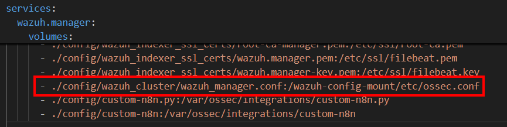


🔹**Configurar la URL generada por el módulo Webhook de n8n.** Esta URL es esencial para que Wazuh pueda enviar los datos correctamente a n8n a través del webhook configurado.

Esta modificación permite agregar una nueva integración mediante el [envío de webhooks](https://documentation.wazuh.com/current/user-manual/manager/integration-with-external-apis.html) para conectar **Wazuh** con **n8n**. El archivo ejecutable **`custom-n8n`** será utilizado para enviar los logs hacia la URL del webhook configurada.


El script configurado para el envío de la alerta através de la integracion configurada previamente se encuentra en:

📂 `/config/wazuh-agent/ossec.conf`

- 🔗 [Documentación Oficial - Integración con APIs externas](https://documentation.wazuh.com/current/user-manual/manager/integration-with-external-apis.html)
- 🛠️ [Ejemplo 1 - Wazuh Integration](https://wazuh.com/blog/how-to-integrate-external-software-using-integrator/)
- ⚙️ [Ejemplo 2 - Webhooks con Wazuh](https://kb.binalyze.com/air/features/integrations/webhooks/wazuh-integration)
  
## Configuración del Flujo en n8n

La configuración del flujo es la siguiente:

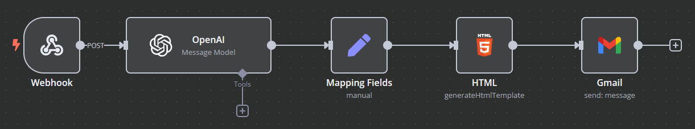

 🔹Se configura el webhook para recibir datos utilizando el método **POST**.
  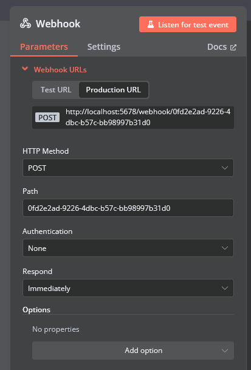
   🔹  **Análisis avanzado con ChatGPT**: Se extraen los procesos involucrados, las palabras clave relevantes y un resumen del contexto de la alerta. 
   
 Es imprescindible crear una cuenta en [**OpenAI Platform Developer**](https://platform.openai.com/docs/overview) y obtener un token de autenticación para configurar una credencial válida que permita a n8n establecer la conexión.
   
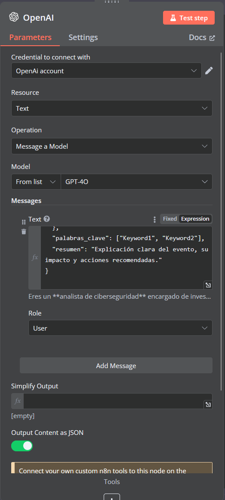
   
   🔹  Se redacta un **prompt** que para situar en el contexto adecuado, indicándole que debe analizar el **JSON** adjunto, el cual contiene la alerta en bruto generada por **Wazuh**. Se le indica que análisis debe realizarse desde la perspectiva de un analista de ciberseguridad.
   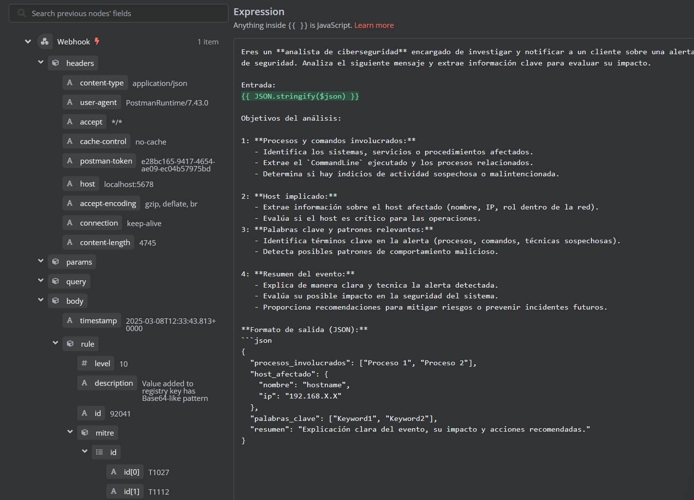
   🔹   Se realiza un mapeo del **output** generado por ChatGPT, extrayendo las palabras clave de interés para incorporarlas en la plantilla **HTML**.
  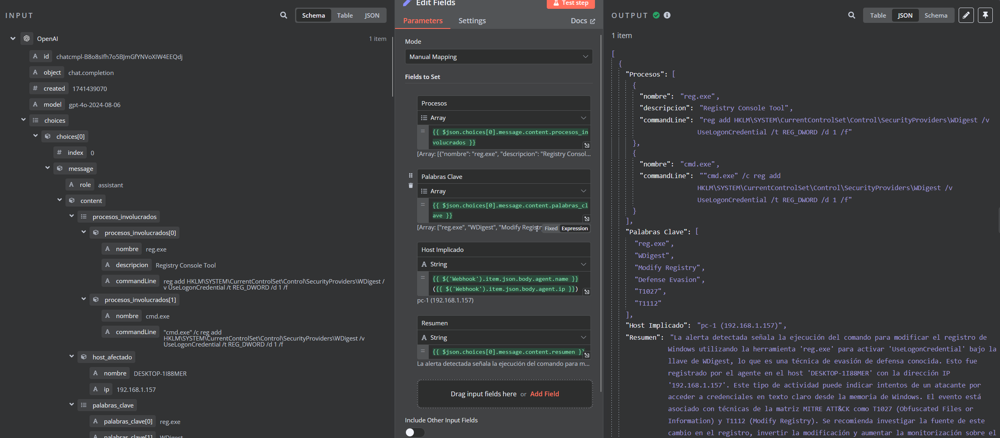
🔹 Creamos una **plantilla HTML** para generar el informe de manera estructurada.

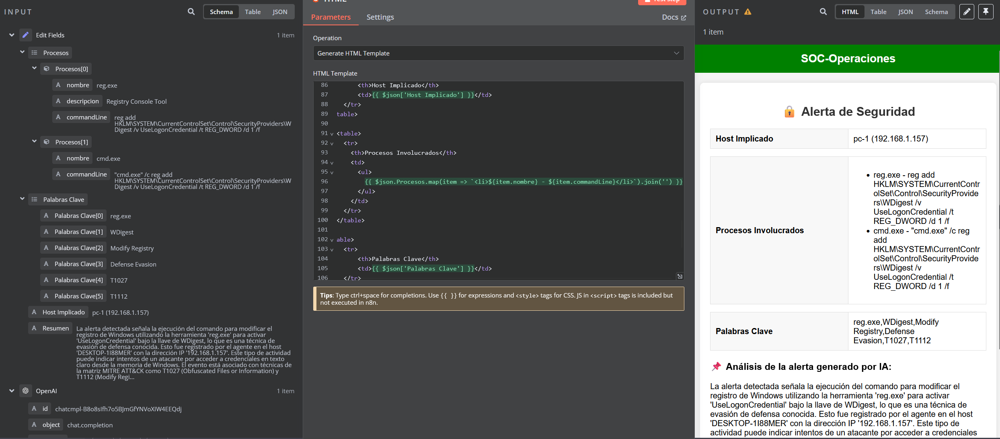

   🔹  Configuramos el envío automático del informe por correo mediante la **API de Gmail**. Para ello, es necesario generar y configurar el token a través de la [Google Cloud Console](https://console.cloud.google.com), siguiendo la [documentación oficial](https://docs.n8n.io/integrations/builtin/credentials/google/oauth-single-service/?utm_source=n8n_app&utm_medium=credential_settings&utm_campaign=create_new_credentials_modal).

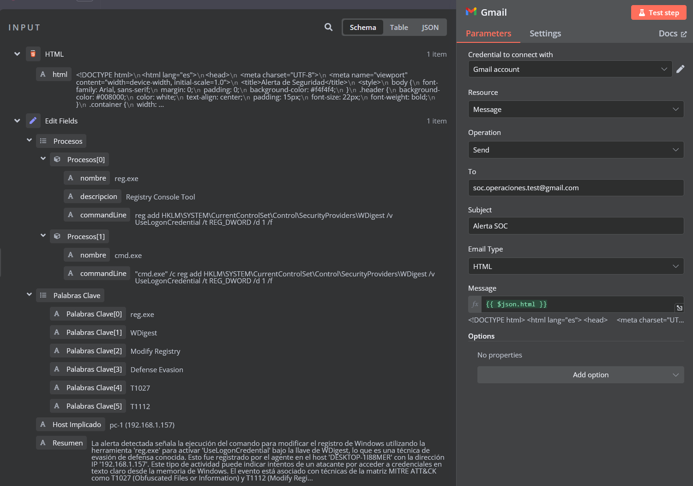

Finalmente, recibiremos el correo con el análisis generado por **ChatGPT**.

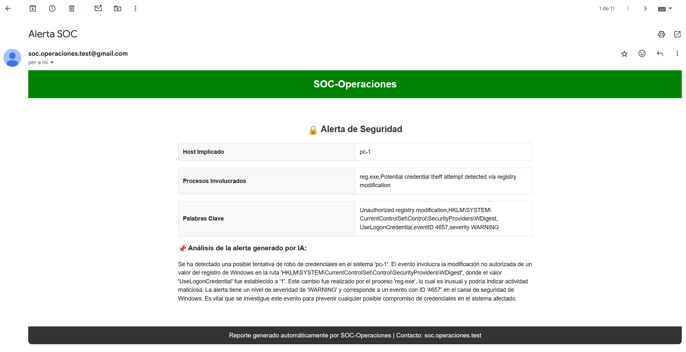

### Plantillas interesantes de n8n:

En [esta página](https://n8n.io/workflows/) se encuentran más de 8,000 plantillas de ejemplo para **n8n**:

1. **[Análisis y clasificación de correos sospechosos con ChatGPT](https://n8n.io/workflows/2666-analyze-and-sort-suspicious-email-contents-with-chatgpt/)**: Automatiza el análisis y clasificación de correos electrónicos sospechosos con **ChatGPT**.
2. **[Análisis de Phishing con URLScan.io y VirusTotal](https://n8n.io/workflows/1992-phishing-analysis-urlscanio-and-virustotal/)**: Realiza análisis de phishing utilizando **URLScan.io** y **VirusTotal**.
3. **[Detecciones de CrowdStrike, búsqueda de IOCs en VirusTotal, Jira y Slack](https://n8n.io/workflows/1973-analyze-crowdstrike-detections-search-for-iocs-in-virustotal-create-a-ticket-in-jira-and-post-a-message-in-slack/)**: Automatiza la respuesta ante detecciones de **CrowdStrike**, busca IOCs en **VirusTotal**, crea tickets en **Jira** y envía notificaciones a **Slack**.

## Configuración del Endpoint a Monitorizar 

Para el monitoreo del sistema, configuramos [**Sysmon**](https://github.com/olafhartong/sysmon-modular) y el agente de [**Wazuh**](https://documentation.wazuh.com/current/installation-guide/wazuh-agent/index.html) en la máquina Windows. 

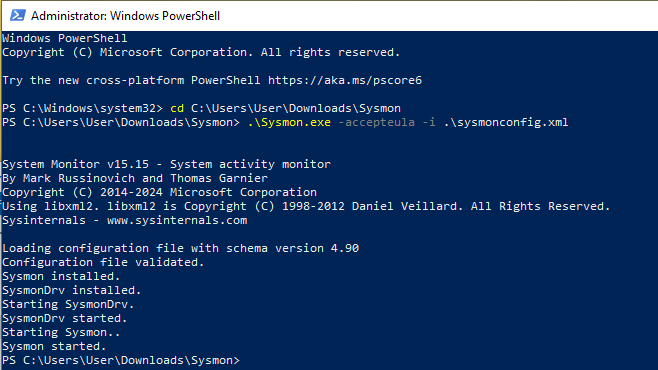

Una vez activado y configurado **Sysmon** en Windows, procederemos con la instalación del agente **Wazuh**. Durante este proceso, es necesario modificar su configuración para incluir la siguiente línea, lo que permitirá que el agente reenvíe los logs generados por **Sysmon**.

~~~~
<localfile> <location>Microsoft-Windows-Sysmon/Operational</location> <log_format>eventchannel</log_format> </localfile>
~~~~

El archivo de configuración para la recopilación de logs de **Sysmon** en **Wazuh Agent** se encuentra en:

📂 `/config/wazuh-agent/ossec.conf`

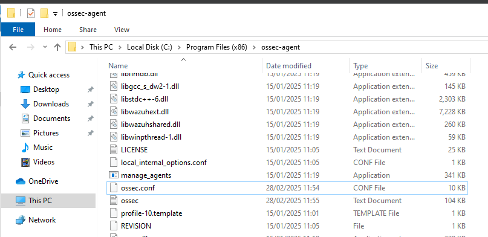

Para simular diferentes tipologías de ataques, utilizamos el framework **Atomic Red Team**. La instalación de **[Atomic Red Team](https://github.com/redcanaryco/invoke-atomicredteam)** se realizó siguiendo la [**documentación oficial**](https://github.com/redcanaryco/invoke-atomicredteam/wiki).

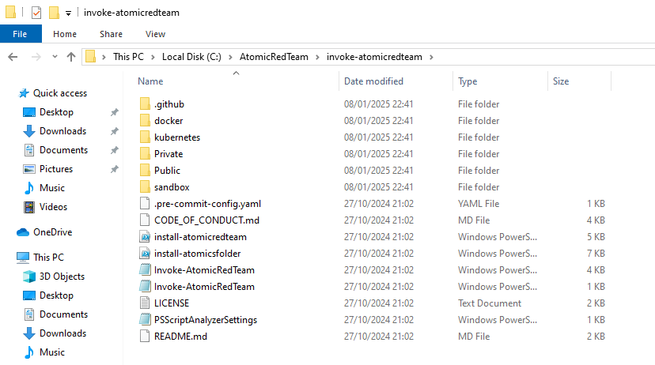

Una vez instalado el framework, es necesario ejecutar el siguiente comando para poder realizar las simulaciones de ataque sin problemas ni restricciones:

~~~~
Set-ExecutionPolicy -Scope CurrentUser -ExecutionPolicy RemoteSigned -Force

Set-ExecutionPolicy unrestricted

Import-Module "C:\AtomicRedTeam\invoke-atomicredteam\Invoke-AtomicRedTeam.psd1" -Force
$PSDefaultParameterValues = @{"Invoke-AtomicTest:PathToAtomicsFolder"="C:\AtomicRedTeam\atomics"}
~~~~

# 🚀 Ejemplos de Ejecución <a name="Ejemplo"></a>

## T1112-3 Modify registry to store logon credentials

Simulación de un ataque que modifica una clave de registro para indicar a Windows que almacene contraseñas en texto plano, lo que hace al sistema vulnerable a la extracción de contraseñas en claro.

Regla [T1112-3](https://github.com/redcanaryco/atomic-red-team/blob/master/atomics/T1112/T1112.md) atomic ejecutada: 

~~~
Invoke-AtomicTest T1112-3 -CheckPrereqs

Invoke-AtomicTest T1112-3
~~~

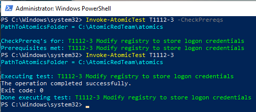

La alerta se genera en Wazuh y luego se envía a N8N a través de un webhook para su procesamiento.

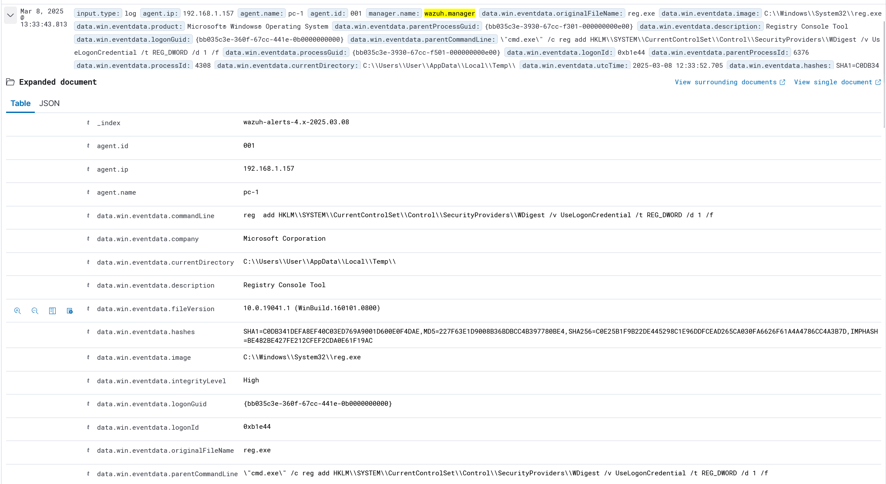

![[alerta.png]]

# T1037-001 Boot or Logon Initialization Scripts: Logon Script

Simulación de ataque en la que un atacante utiliza los scripts de inicio de sesión de Windows para establecer persistencia. Esto se logra mediante la modificación del registro para agregar un valor que ejecuta un script batch ubicado en el directorio `%temp%`. Al ejecutarse, se crea una nueva variable de entorno en la clave `HKCU\Environment`, la cual es visible en el Editor del Registro. Esta técnica garantiza que el script se ejecute automáticamente cada vez que el usuario inicie sesión, asegurando la persistencia del atacante.

Regla [T1037-001](https://github.com/redcanaryco/atomic-red-team/blob/master/atomics/T1037.001/T1037.001.md) atomic ejecutada: 

~~~
Invoke-AtomicTest T1037.001 -CheckPrereqs

Invoke-AtomicTest T1037.001
~~~~

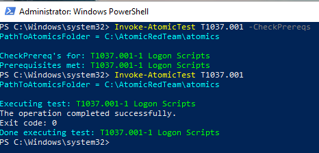

Encontramos la alerta generada en Wazuh

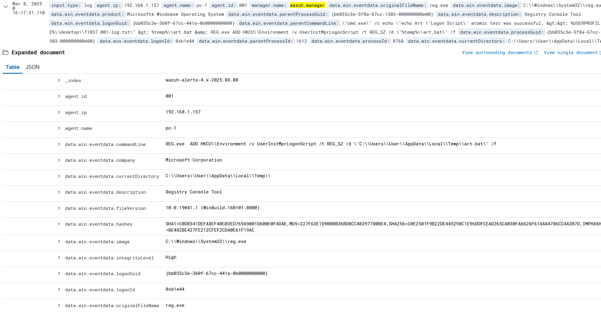


Para mejorar el análisis de la alerta, podemos ajustar el prompt que le proporcionamos a ChatGPT, pidiéndole que realice un análisis más técnico y detallado. En este caso, se solicita que el análisis sea más enfocado en los aspectos técnicos, sin incluir recomendaciones o sugerencias.

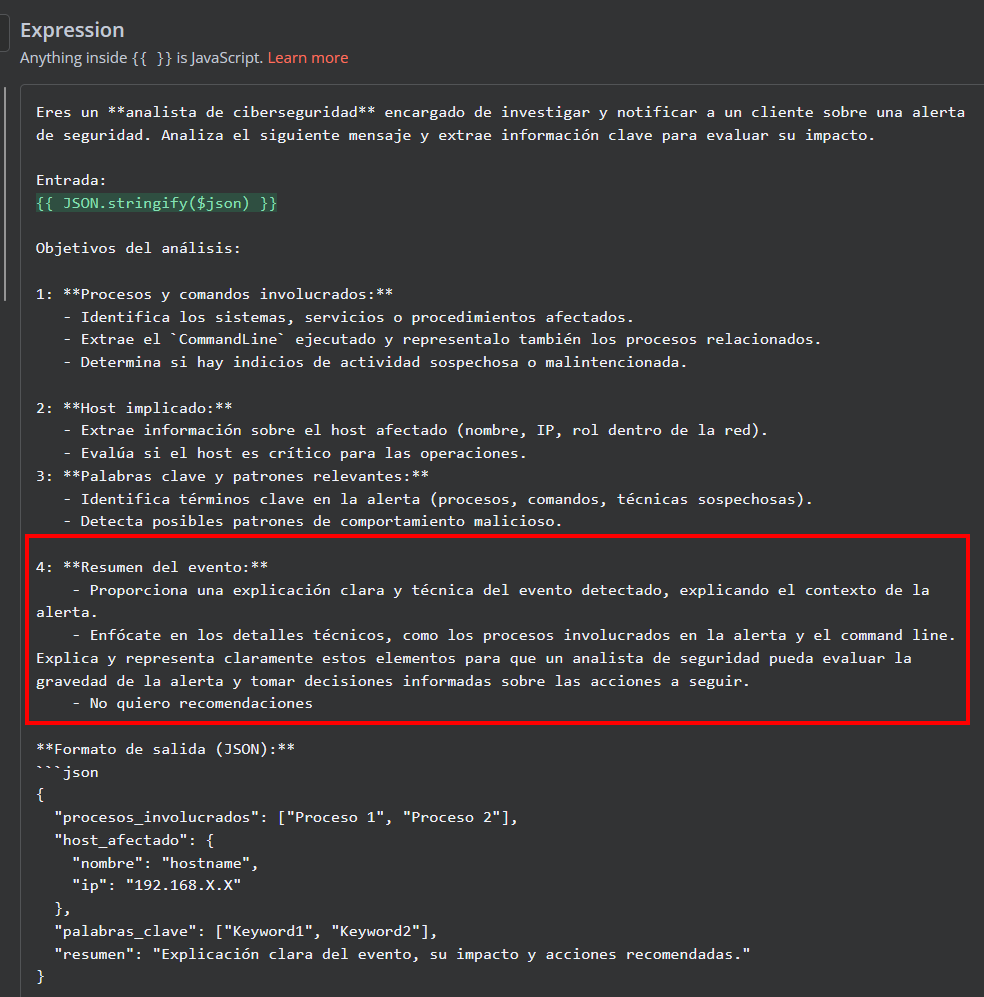

Podemos observar cómo, al ajustar el planteamiento del prompt con el mismo ataque ejecutado, obtenemos un análisis más detallado y técnico. Esto nos permite configurar diferentes tipos de notificación de alertas, adaptándolas al perfil que deseamos, ya sea más ejecutivo o más técnico, según las necesidades y el nivel de detalle requerido para cada caso.

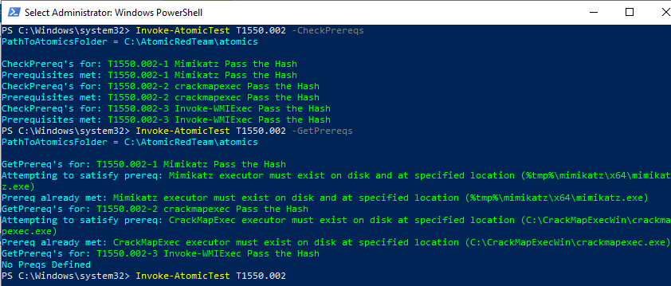

## T1550-002 Use Alternate Authentication Material: Pass the Hash
Simularemos la tecnica Pass the Hash,  los atacantes la utilizan para acceder a sistemas sin necesidad de conocer la contraseña real de un usuario. En lugar de usar la contraseña en texto claro, el atacante roba el "hash" de la contraseña, que es una versión cifrada de la misma. Luego, utiliza ese hash para hacerse pasar por el usuario y acceder al sistema.

Regla [T1550-002](https://github.com/redcanaryco/atomic-red-team/blob/master/atomics/T1550.002/T1550.002.md) atomic ejecutada: 

~~~
Invoke-AtomicTest T1550.002 -CheckPrereqs

Invoke-AtomicTest T1550.002 -GetPrereqs

Invoke-AtomicTest T1550.002
~~~~


Podemos observar cómo Wazuh ha detectado un posible volcado de memoria realizado por Mimikatz.

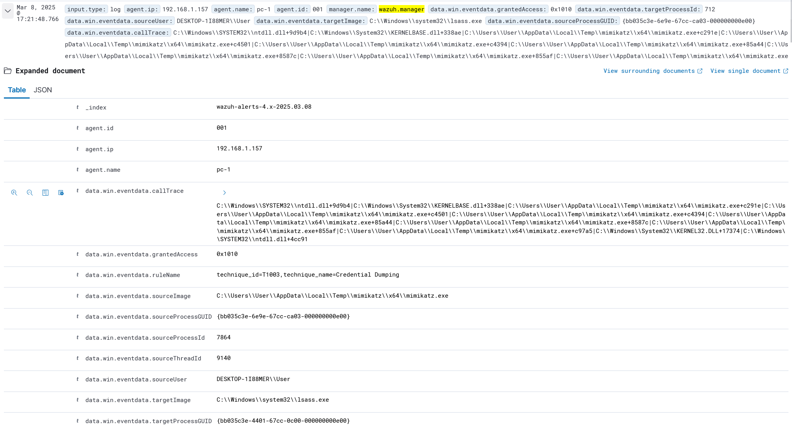

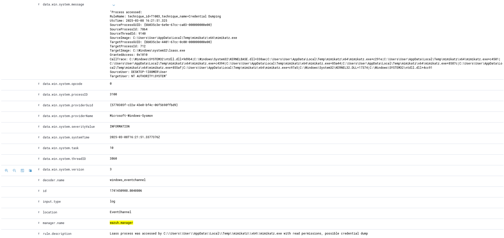

Por último, vemos cómo al indicarle en el prompt que sea más técnico y detallado, logramos obtener un análisis más claro y exhaustivo.

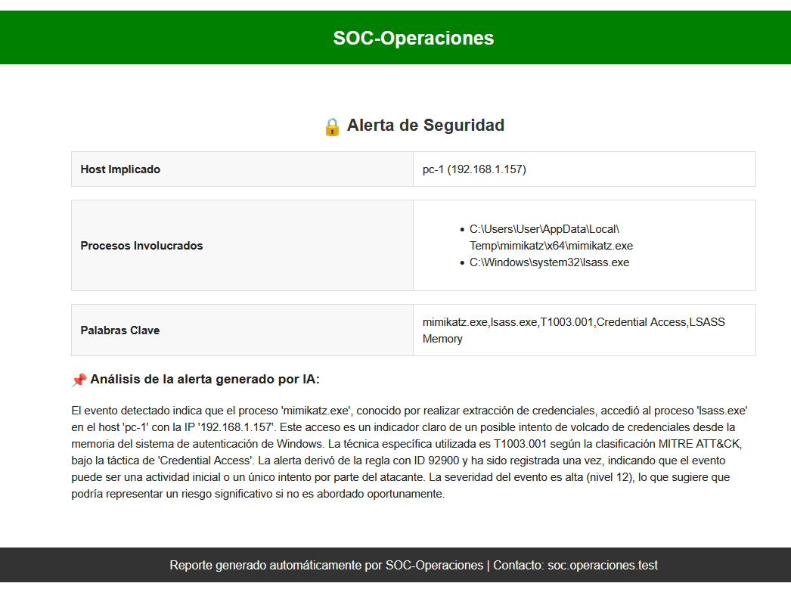

# 🧠 Reflexión y conclusiones finales <a name="Reflexión"></a>

Para finalizar, quiero compartir una breve reflexión sobre el objetivo de este mini proyecto. Mi intención ha sido explorar hasta qué punto, con el uso de la inteligencia artificial y la automatización—dos conceptos muy de moda en el sector IT—podemos mejorar el análisis de alertas de seguridad. En este caso, lo he aplicado a **Wazuh**, pero este enfoque podría integrarse fácilmente con soluciones **EDR** o **SIEM**.

Si bien no se trata de una investigación exhaustiva, he podido comprobar que, con un **prompt adecuado** y estructurando bien el flujo de datos, **ChatGPT** es capaz de analizar alertas de seguridad con un nivel de acierto interesante. Sin embargo, esto no significa que la IA pueda reemplazar a los analistas de N1 o N2 en un SOC, al menos por ahora.

Estos flujos pueden **agilizar el trabajo de los analistas**, permitiéndoles ahorrar tiempo en tareas repetitivas, como redactar definiciones de herramientas o describir eventos comunes (por ejemplo, un volcado de memoria con **Mimikatz** o una técnica de persistencia en Windows). De hecho, estoy seguro de que muchos analistas ya recurren a **ChatGPT** u otras herramientas similares para analizar comandos en **PowerShell**, generar descripciones rápidas de procesos relacionados con una alerta y realizar otras tareas de apoyo.

La diferencia es que ahora la IA no solo puede asistir en tareas puntuales, sino también **interpretar los datos y generar explicaciones estructuradas y comprensibles**, que el analista solo tendría que validar y contextualizar, optimizando así el proceso de análisis.

En lugar de enfocarse en una única alerta, los analistas podrían dedicar más tiempo a **investigar el contexto del posible incidente**, identificando correlaciones y patrones más amplios. En la práctica, muchas veces terminamos buscando en **Google** la definición de herramientas o técnicas, copiando y adaptando la información para el cliente. Automatizar este proceso con IA reduciría la carga de trabajo, permitiendo que los analistas se centren en una investigación más profunda y en la toma de decisiones para la respuesta a incidentes.

A nivel personal, este mini proyecto también me ha permitido volver a trabajar con el despliegue de servicios en **Docker**, ampliar mi conocimiento de **Wazuh**, y aprender sobre el funcionamiento de **n8n**, un **SOAR open-source** con mucho potencial. Además, he podido realizar pequeñas simulaciones de ataques utilizando la herramienta **Atomic Red Team**, lo que ha enriquecido aún más la experiencia.

En definitiva, la combinación de **automatización + IA** no sustituirá el trabajo de los analistas, pero sí puede convertirse en un **aliado clave para optimizar procesos y mejorar la eficiencia en la gestión de eventos dentro de un SOC o servicio MDR.

### 📖 Referencias y documentación

🔗 **[N8N - Despliegue en Docker](https://docs.n8n.io/hosting/installation/docker/)**  
🔗 **[Wazuh - Despliegue en Docker](https://documentation.wazuh.com/current/deployment-options/docker/wazuh-container.html)**  
🔗 **[Wazuh - Integración con APIs Externas - Documentación Oficial](https://documentation.wazuh.com/current/user-manual/manager/integration-with-external-apis.html)**  
🔗 **[Wazuh - Integración con Software Externo](https://wazuh.com/blog/how-to-integrate-external-software-using-integrator/)**  
🔗 **[Wazuh - Integración con Webhooks](https://kb.binalyze.com/air/features/integrations/webhooks/wazuh-integration)**  
🔗 **[Sysmon - Guía de Configuración e Instalación](https://github.com/olafhartong/sysmon-modular)**  
🔗 **[Wazuh - Guía de Instalación del Agente](https://documentation.wazuh.com/current/installation-guide/wazuh-agent/index.html)**  
🔗 **[OpenAI Platform Developer - Acceso a la API](https://platform.openai.com/docs/overview)**  
🔗 **[Google Cloud Console - Configuración de API de Gmail](https://console.cloud.google.com)**  
🔗 **[Documentación de Google OAuth para n8n](https://docs.n8n.io/integrations/builtin/credentials/google/oauth-single-service/?utm_source=n8n_app&utm_medium=credential_settings&utm_campaign=create_new_credentials_modal)**  
🔗 **[Atomic Red Team - Repositorio en GitHub](https://github.com/redcanaryco/invoke-atomicredteam)**  
🔗 **[Atomic Red Team - Documentación Oficial](https://github.com/redcanaryco/invoke-atomicredteam/wiki)**  
🔗 **[T1112 - Atomic Red Team](https://github.com/redcanaryco/atomic-red-team/blob/master/atomics/T1112/T1112.md)**  
🔗 **[T1037.001 - Atomic Red Team](https://github.com/redcanaryco/atomic-red-team/blob/master/atomics/T1037.001/T1037.001.md)**  
🔗 **[T1550.002 - Atomic Red Team](https://github.com/redcanaryco/atomic-red-team/blob/master/atomics/T1550.002/T1550.002.md)**
